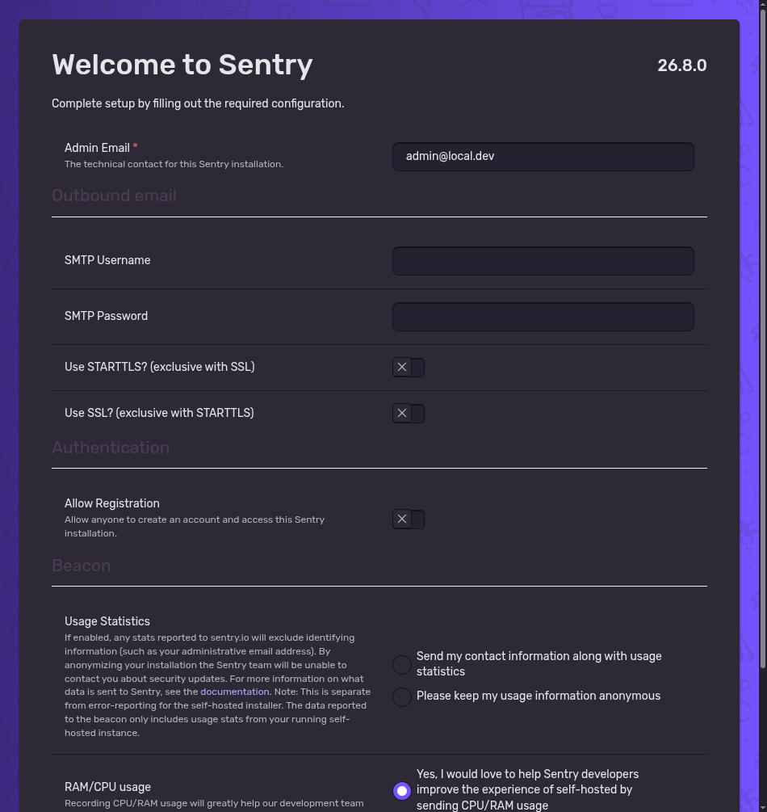
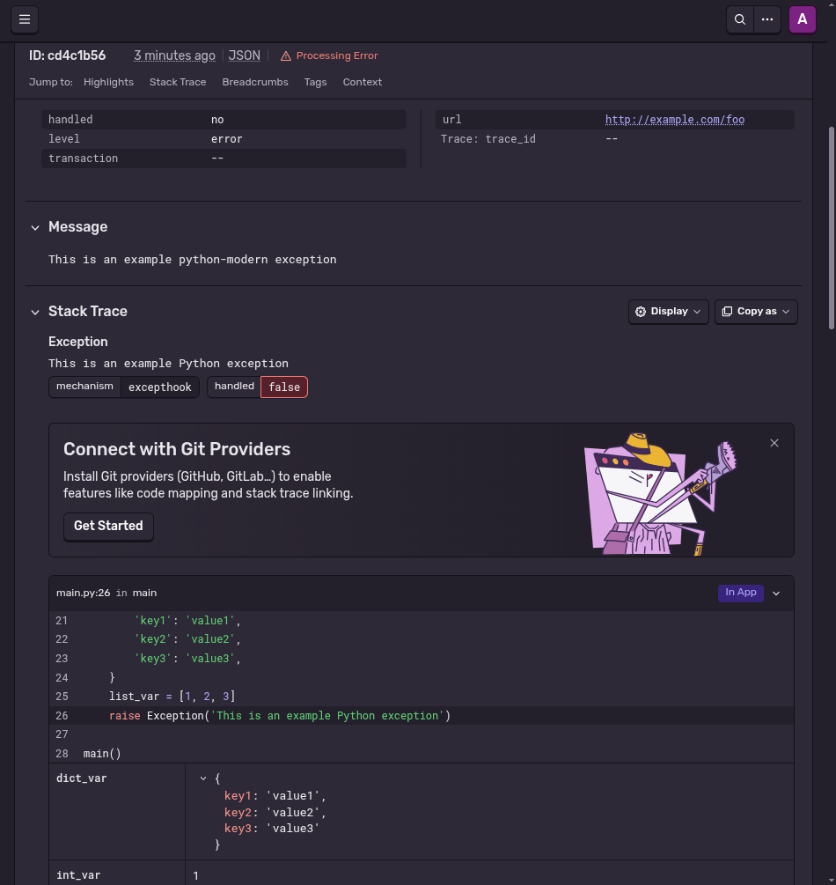
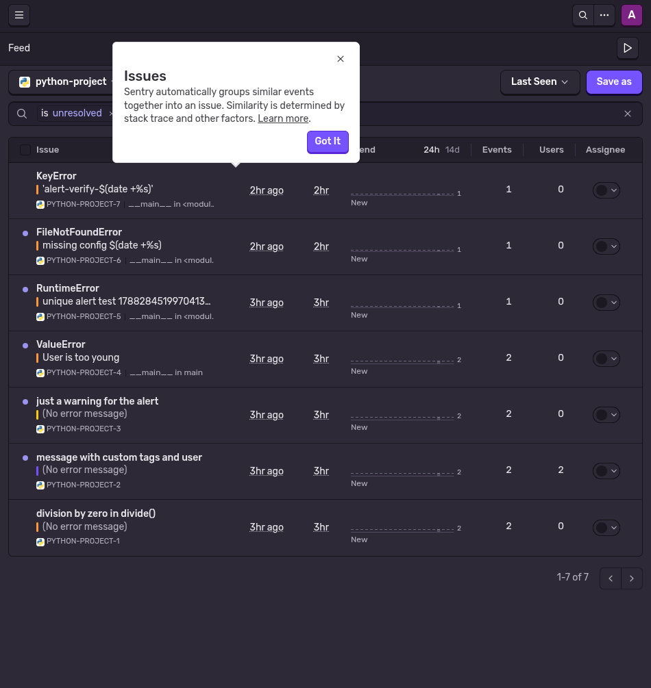
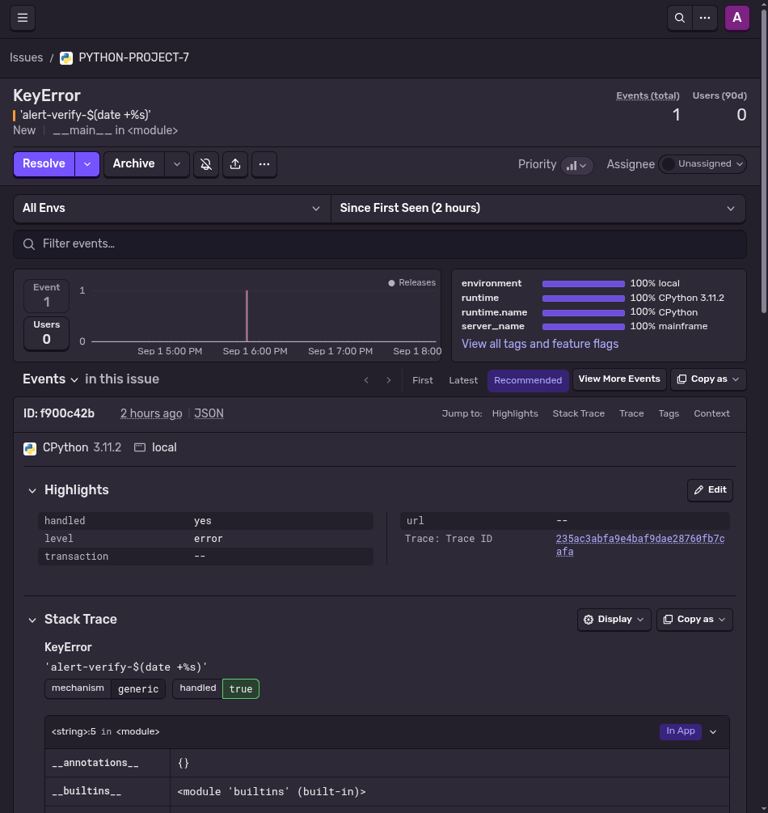
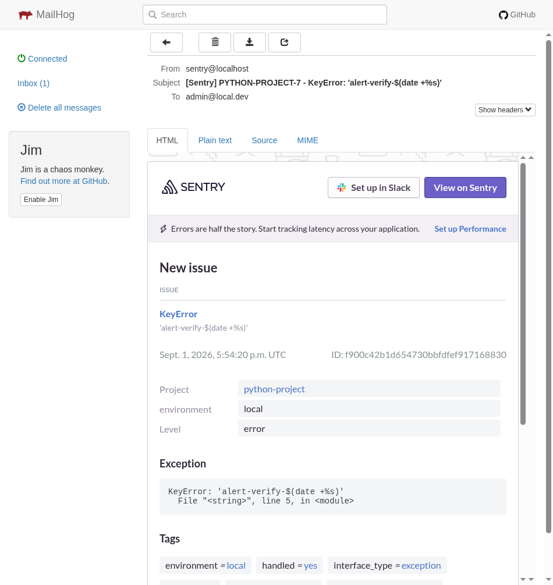

# Домашнее задание «Платформа мониторинга Sentry»

> Вместо Free Cloud учётной записи использован self-hosted Sentry
> (развёрнут в Docker на `192.168.50.42`, порт `9000`), проект `python-project`.
>
> Развертываемая часть (compose + конфиги) — в папке [deploy/](deploy/):
> base `docker-compose.yml` берётся из официального
> [`getsentry/self-hosted`](https://github.com/getsentry/self-hosted) (release 26.8.0),
> свои конфиги — `docker-compose.override.yml` (MailHog для почты) и `.env`.

## Задание 1

Меню Projects:



## Задание 2

1. В проекте создано python-приложение и связано с Sentry.
2. Сгенерировано тестовое событие (`create-sample`) — issue `PYTHON-PROJECT-8`.
3. Stack trace события:



4. Событие помечено `Resolved` — список issues проекта после этого:



## Задание 3

Правило алёртинга «All new issues» создано по умолчанию
(условие — «событие происходит»: `EveryEventCondition`, интервал 1m,
частота 30 минут, действие — email активным членам организации).

Проверка правила созданием события `KeyError` (через алёрт-проверку/генерацию sample event):



Оповещение пришло на почту (self-hosted использует MailHog, ящик `admin@local.dev`):



## Задание повышенной сложности

Создан python-проект (~45 строк), подключён Sentry SDK и отправлены несколько
тестовых событий: исключение, `capture_message`, кастомные `tag`/`user` и warning.

Меню issues проекта (лента событий):


Пример кода подключения SDK и отправки событий — [app.py](app.py):

```python
import os
import random
import time

import sentry_sdk

DSN = os.environ["SENTRY_DSN"]

sentry_sdk.init(
    dsn=DSN,
    traces_sample_rate=1.0,
    environment="local",
    release="homework@1.0.0",
)

def divide(a, b):
    return a / b

def main():
    print("sending events...")
    try:
        raise ValueError("User is too young")
    except Exception:
        sentry_sdk.capture_exception()

    try:
        divide(10, 0)
    except ZeroDivisionError:
        sentry_sdk.capture_message("division by zero in divide()", level="error")

    sentry_sdk.capture_message("just a warning for the alert", level="warning")
    with sentry_sdk.configure_scope() as scope:
        scope.set_tag("homework", "monitoring-05")
        scope.set_user({"id": str(random.randint(1, 9999)), "email": "tester@local.dev"})
        sentry_sdk.capture_message("message with custom tags and user")

    print("done, waiting for flush...")
    time.sleep(2)
    sentry_sdk.flush()

if __name__ == "__main__":
    main()
```

## Развертывание (deploy)

Полный стек — официальный self-hosted (`getsentry/self-hosted`, 26.8.0):
web, relay, snuba, clickhouse, postgres, kafka, redis, symbolicator и т.д.
В [deploy/](deploy/) лежат только свои конфиги:

```bash
git clone https://github.com/getsentry/self-hosted.git && cd self-hosted
git checkout 26.8.0
cp ../deploy/.env ./
cp ../deploy/docker-compose.override.yml ./
sudo ./install.sh
sudo docker compose up -d
```

Отличия от дефолта (`deploy/docker-compose.override.yml` + `deploy/.env`):
- добавлен сервис **MailHog** — перехватчик почты (UI `:8025`, SMTP `:1025`);
  Sentry настроен на `mail.host=mailhog:1025`, поэтому alert-письма
  «приходят» и видны в MailHog (скриншот выше);
- `SENTRY_BIND=9000` — наружу отдаётся только nginx на порту 9000;
- образы зафиксированы на релиз 26.8.0, retention событий — 90 дней.